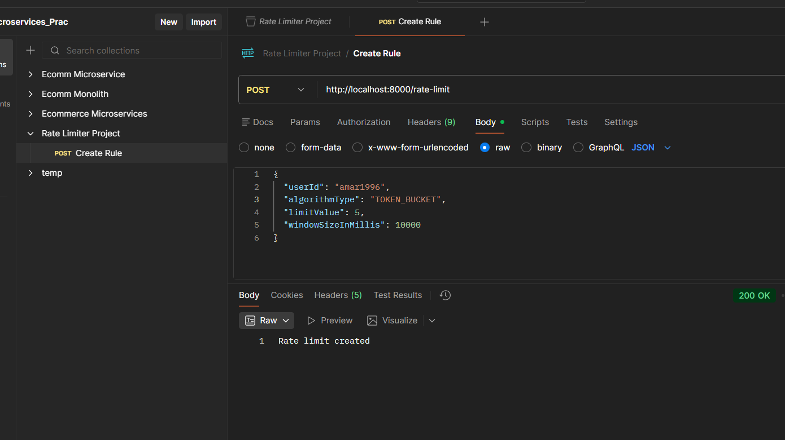
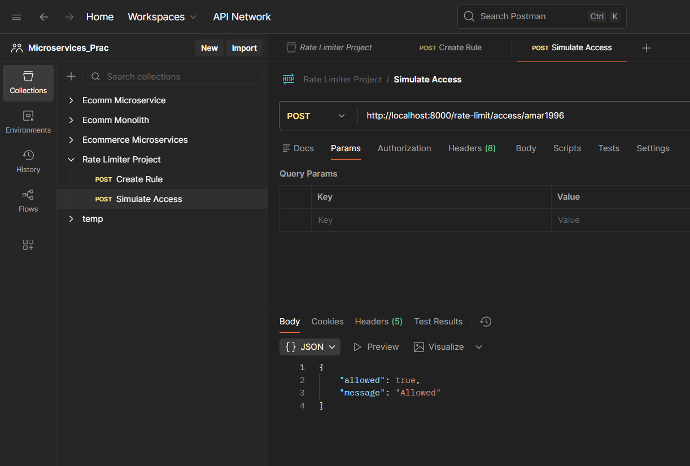
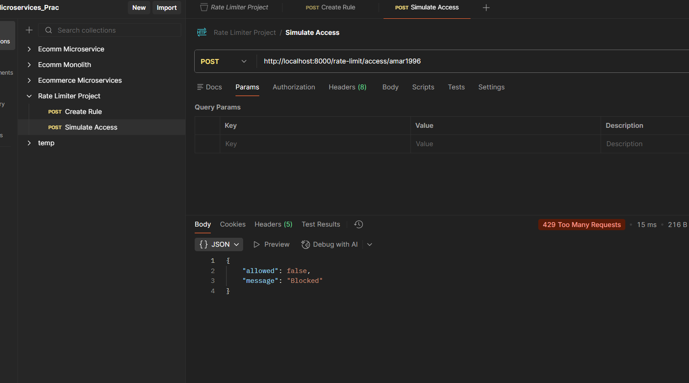
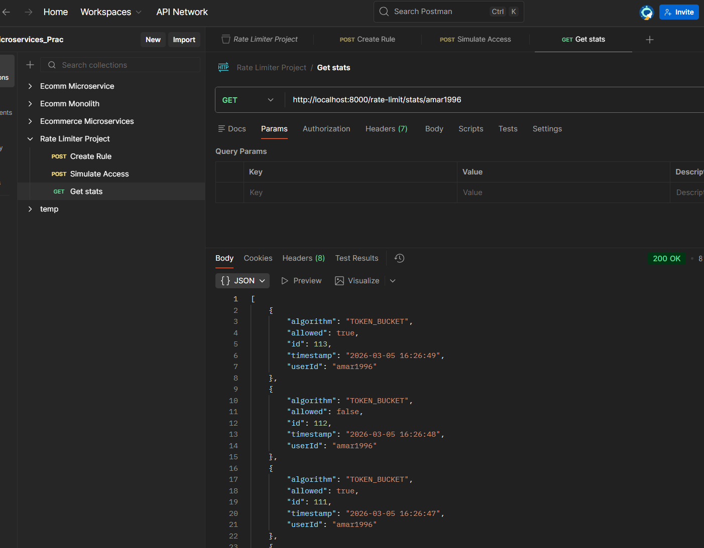
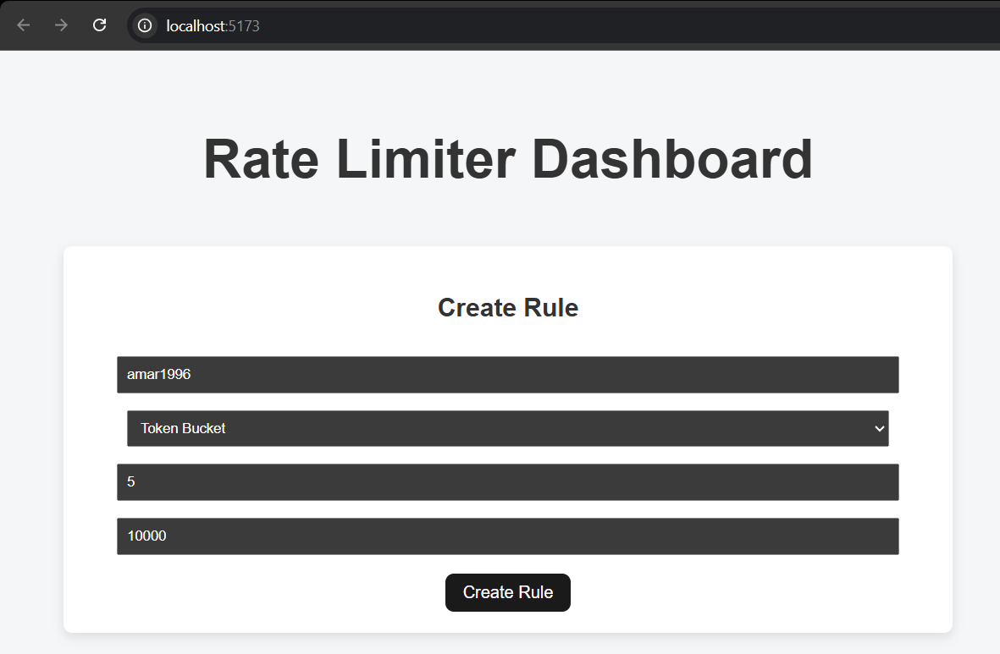
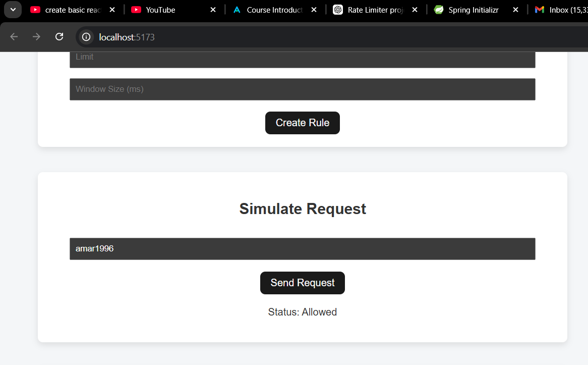

# Smart Rate Limiter Service
---

A configurable backend rate limiting service built using **Spring Boot**, **PostgreSQL**, and **React**.

Supports multiple industry-standard algorithms:

- Fixed Window
- Sliding Window
- Token Bucket

Designed with scalability, extensibility, and concurrency in mind.

---

## Features

- Configurable rate limit per user  
- Supports 3 algorithms via Strategy Pattern  
- Factory Pattern for dynamic algorithm creation  
- Thread-safe implementation using ConcurrentHashMap  
- Violation logging and stats tracking  
- REST API based microservice  
- Basic React dashboard for demonstration  

---

### Architecture Overview

1. React UI sends requests to backend.
2. Spring Boot exposes REST APIs.
3. RateLimiterService loads configuration from PostgreSQL.
4. Factory dynamically creates strategy.
5. In-memory concurrent map stores active limiters.
6. Violations and Request logs are logged in database.

---

##  Design Patterns Used

### Strategy Pattern
Each rate limiting algorithm implements a RateLimiterStrategy interface:

Implementations:
- FixedWindowRateLimiter
- SlidingWindowRateLimiter
- TokenBucketRateLimiter

---

### Factory Pattern

RateLimiterFactory dynamically creates strategy based on configuration.

---

##  Algorithms Implemented

### 1. Fixed Window
- O(1) time complexity
- Simple counter reset mechanism
- Burst issue at boundary

---

### 2. Sliding Window
- Stores timestamps
- Removes expired entries
- More accurate than fixed window

---

### 3. Token Bucket
- Industry-preferred approach
- Smooth traffic control
- Supports burst handling

---

## 📊 API Endpoints

### Create Rate Limit

POST `/rate-limit`

Postman API output:

### Access API

POST `/rate-limit/access/{userId}`

* Postman API output:

### Get latest top 50 stats

GET `/rate-limit/stats/{userId}`

* Postman API output:

## Working:
---
#### Create Rule:

#### Simulate requests(Send requests entered userid):

#### Fetch top 50 request stats:

---
## Database Schema
---

#### RateLimitConfig
- id
- userId
- algorithmType
- limitValue
- windowSizeInMillis

#### ViolationLog
- id
- userId
- timestamp
- reason